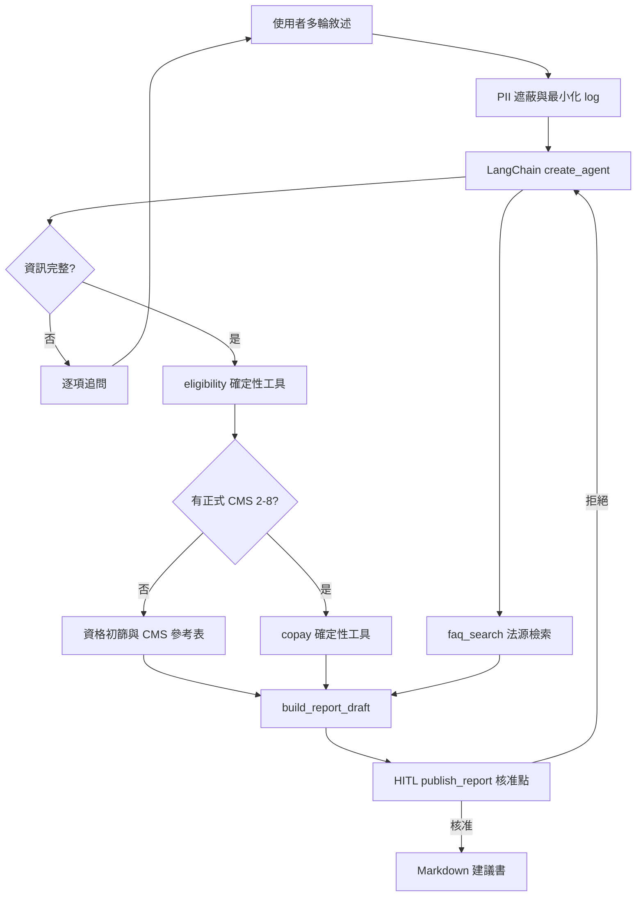

# ltc-benefit-agent 開發藍圖

> 本檔是專案內部的決策與驗收依據；即時狀態見 `PROGRESS.md`，公開說明未來放在 `README.md`，開發守則以 `CLAUDE.md`／`AGENTS.md` 為最高優先。
>
> 修改規則：重要決策以新編號追加到 Decision Log，不覆寫舊決策；每次決策變更也要記入 `PROGRESS.md`。文件與實作衝突時，以程式碼與測試證據 > PROGRESS > PLAN > README 的順序仲裁。

## 專案目標與設計哲學

建立繁體中文多輪 AI Agent，協助民眾初步理解自己是否可能符合台灣長照服務申請條件，並依使用者提供的正式 CMS 等級試算照顧及專業服務月額、部分負擔、政府給付與超額自費。

核心原則是「可驗證、可稽核」：

- LLM 只處理對話理解、缺漏追問、工具選擇、法源摘要與非金額敘述。
- 資格規則、版本差異、額度、比例、無條件捨去與超額計算全部由純 Python 工具執行。
- CMS 未知時不得由對話描述猜測等級，不產出個人化金額。
- 所有結果都標示規則版本、資料日期、法源與免責聲明。
- 最終報告在顯示前必須通過 human-in-the-loop 核准。

### 非目標

1. 不取代照管中心的正式失能評估、資格核定或照顧計畫。
2. 不從 ADL/IADL 描述自行推定 CMS 2–8 級。
3. v1 不個人化計算交通接送、輔具、居家無障礙改善或喘息服務；這些項目只由 FAQ 說明。
4. 不支援 2022 舊制與 2026-07 現制之間各過渡日期的完整歷史時光機。
5. 不收集或要求姓名、身分證字號、電話、住址等非必要個資。
6. 不提供法律、醫療或財務建議，也不保證實際核定金額。
7. 不在本專案中部署或管理 Hugging Face Space、GitHub repo、API Secrets。

## Decision Log（append-only）

| # | 日期 | 決策 | 理由 |
|---|---|---|---|
| D1 | 2026-07-22 | LLM 不做資格與金額判斷；全部委派給確定性工具 | 防止心算、幻覺與不可稽核的結論 |
| D2 | 2026-07-22 | 支援 `LEGACY_2022` 與 `CURRENT_2026_07` 兩個固定快照；現制預設、舊制按需比較 | 兼顧歷史教育與現行實用性，避免把過渡期混入 v1 |
| D3 | 2026-07-22 | CMS 未知時不猜級，只提供申請初篩、2–8 級參考表與 1966 指引 | CMS 是照管中心正式評估結果 |
| D4 | 2026-07-22 | 自付試算優先使用預計服務費；未知時另列「額度全數使用」情境 | 避免把滿額自付誤認成固定月費 |
| D5 | 2026-07-22 | 規劃與進度分為 PLAN／PROGRESS；project skills 放 `.claude/skills` | 沿用姊妹作的恢復脈絡方式，避免單檔過長 |
| D6 | 2026-07-22 | 地端模式使用原始 gated F1-Instruct，自轉 Q4_K_M 後匯入 Ollama | Ollama 社群現成項目是不同的 Reasoning 變體，不能冒用原模型 BFCL 證據 |
| D7 | 2026-07-22 | 評估採 20 個固定多輪情境，Gemini、F1 與 Gemma 3 12B 基準各跑一次 | 以成對情境比較工具呼叫能力，並保留國際基準 |
| D8 | 2026-07-22 | Agent 永不執行 Git 指令；只提供建議 commit 訊息與 tag | Git 歷史與發佈節奏由作者本人掌握 |
| D9 | 2026-07-22 | 每個 Phase 完成、展示證據、獲作者確認後才進下一 Phase | 維持可回復、可驗收的小步交付 |
| D10 | 2026-07-22 | FAQ 優先接已安裝的姊妹作 `HybridRetriever`，否則使用 standalone 極簡檢索 | 本機可重用成果，GitHub／Space 又不依賴相鄰資料夾 |
| D11 | 2026-07-22 | 最終報告先確定性建稿，再由 `publish_report` 觸發 approve／reject | 讓人工看到完整數字與文字後才決定是否公開 |
| D12 | 2026-07-22 | Phase 4 交付 Space-ready 設定但不代為上線；Space 僅開雲端模式 | Ollama 是 Windows 本機服務，帳號與 Secrets 操作留給作者 |
| D13 | 2026-07-22 | 現制 PAC 短期需求不套一般六個月門檻；團體家屋在兩版均視為排除 | 2025 修法對照表明載 PAC 為短期需求，並說明團體家屋自 2020 年函釋即不列為給付對象，現制只是明文化 |
| D14 | 2026-07-22 | 作者睡前授權本次夜間工作跨 Phase 連續進行；付費 API、gated 授權與帳號操作仍維持原 gate | 善用無人值守時間，但不把一般開發授權擴張成費用或授權條款同意 |
| D15 | 2026-07-22 | 既有 12B 基準以明示相容 tool template 評估，結果不得稱為原模型 native tool calling | 原始本機 manifest 實測只有 completion／vision，直接傳 tools 回 400 |
| D16 | 2026-07-22 | approve 後的對外最終文字由 service 直接鎖定人工預覽，不採用模型收到 tool result 後的重述 | 真實本機模型會摘要工具結果；人工核准的是完整草稿而非後續生成文字 |
| D17 | 2026-07-22 | 電話遮蔽只接受台灣有效區碼起始範圍，避免官方附件 FileId 被誤判 | 真實 trace 發現十位數官方檔案編號遭原 regex 遮蔽；修正後 URL 與 PII 測試均通過 |
| D18 | 2026-07-22 | 未經確定性 renderer 與人工核准的模型訊息只要包含幣值或百分比，就由 service 阻擋 | F1 實測會在正確工具呼叫後自行生成錯誤金額；安全性不能只依賴 prompt 遵循 |
| D19 | 2026-07-22 | 雲端 key 依主要、backup 1–3 排序；只有明確 quota／rate-limit 才切換，其他錯誤不換 key，所有紀錄只留 slot 不留值 | 避免一般錯誤造成無界重試或秘密洩漏，並維持每次作者核准的總成本上限 |
| D20 | 2026-07-22 | Context7 只作開發期外部 API 查證；先比對 `uv.lock`，查證摘要留在 PROGRESS，不加入正式 Agent runtime | 避免套件更新造成舊 API 實作，同時不把民眾對話或專案秘密送往文件服務 |
| D21 | 2026-07-22 | 雲端診斷共用 12 requests/minute 限速器、停用 connector 自動重試；只有零進度 quota 錯誤可換 slot | 實測專案限制為 15 requests/minute；保留 20% 安全邊際並防止重送造成不可控成本 |
| D22 | 2026-07-22 | `CURRENT_2026_07` 表示分階段修正全部施行後的完整快照；報告顯示「完整快照基準」並列出各階段日期 | 第 22 條明定不同修正分別於 2025-09-01、2026-01-01、2026-07-01 施行，不能把快照日期誤寫成所有規則的單一生效日 |
| D23 | 2026-07-22 | Gradio 採簡潔的產品工具介面；品牌感受為清楚、可信、平靜，正文以約 18 px 與 WCAG AA 為基準 | 主要使用者包含高齡者與家庭照顧者，任務效率、可讀性與資訊層級應優先於帳冊、印章等裝飾性視覺 |
| D24 | 2026-07-22 | 模型在成功工具後提早停止時，由 workflow middleware 依既有工具證據有限續跑；每階段最多提醒一次、每輪最多三次，缺漏資訊時不介入 | 20 題 trace 顯示主要失敗點是資格／金額工具完成後未建稿或未發布；續跑層只控制既定順序，不解析使用者敘述、不補參數，也不碰資格與金額判斷 |
| D25 | 2026-07-22 | `copay_estimate` 成功後由 middleware 複製已驗證的資格／金額 tool args 建稿；`build_report_draft` 成功後複製 registry 回傳的 ID 與原文送進既有 HITL | 3B 實測即使收到續跑提示仍不願呼叫複雜建稿工具；確定性接續不需要重新解析對話或請 LLM 重抄數字，且 publish 仍必須 approve／reject |
| D26 | 2026-07-22 | F1 Ollama Hermes template 的每個 `<tool_response>` 必須同時包含 `.ToolName` 與 `.Content` | 官方 tokenizer chat template 以工具名配對回傳；舊模板只放內容，實測造成第一個工具後空白，修正後 S11／S14 與固定 20 題能繼續多工具流程 |
| D27 | 2026-07-22 | 雲端主模型遷移為 stable `gemini-3.5-flash-lite`；不傳 `temperature`／`top_p`／`top_k`，tool-calling 預設 `thinking_level=medium` 且可由環境變數調整 | 官方模型頁確認新型號為 GA 且支援 function calling；遷移文件要求移除 sampling 參數，並建議多步工具任務使用 medium 或 high thinking |
| D28 | 2026-07-22 | 在 PII 遮蔽後以 intake middleware／thread state 保存可逐字核對的必要欄位；模型未被使用者明確告知的值維持未知，跳過資格前置時只允許用已保存資料重檢資格 | 地端 trace 顯示小模型會跨輪遺忘 CMS 或自行補入 `false`／`COMMUNITY`，造成工具參數漂移與提前建稿；此層只驗證資料來源與工具順序，不判資格、不算金額 |
| D29 | 2026-07-22 | 人工 approve 後以已展示 preview 作唯一最終輸出，並忽略 provider adapter 回帶的歷史 interrupt metadata | 12B 相容 adapter 會在核准後附回已處理的 interrupt；若再次當成待處理狀態，會讓提示文字覆蓋已核准報告 |
| D30 | 2026-07-22 | 至少兩個明確資格欄位下若模型漏掉第一個資格工具，只允許一次隔離原始對話、僅暴露 `eligibility_check` 的結構化重試；相容 adapter 只正規化模型明確輸出的單一合法 fenced JSON tool call | S01／S20 trace 顯示 12B 會以散文停止；有限重試可讓模型重新選工具，又不從散文猜意圖、不補參數、不由 middleware 冒充模型完成初始工具選擇 |
| D31 | 2026-07-22 | Space-ready 交付使用根目錄 README YAML metadata、`app.py` 與 `requirements.txt`；完整 runtime constraints 由 `uv.lock` 匯出為 `requirements.lock.txt`，最後以 `-e .` 安裝專案 | 託管 runtime 以 pip 解析，僅固定頂層套件仍會讓 transitive dependency 漂移；完整匯出讓 Space 與本輪 lock 逐項同版，Space 偵測後只開雲端 provider |
| D34 | 2026-07-22 | Space 的完整 runtime constraints 改為直接內嵌於 `requirements.txt`，不再引用相鄰的 `requirements.lock.txt` | 首次公開建置證明 Space builder 只將入口檔複製到 `/tmp`；整合成單檔可保留逐項 pin、避免 include 路徑失效，測試仍逐字比對 `uv export` |
| D35 | 2026-07-23 | Space 的 `requirements.txt` 只安裝鎖定的外部套件，不使用 `-e .`；根目錄 `app.py` 在 runtime 以 `pathlib` 載入 `src/` | 第二次公開建置證明 pipfreeze 發生在 repository 複製到 `/app` 之前，該階段不存在 `pyproject.toml`；入口自舉符合 Space 建置順序且不影響本機 uv package |
| D36 | 2026-07-23 | 依 Gradio 6.20.0 的 Space extras 將 Pydantic 限制為 `>=2.11.10,<2.12.5`，並以公開 builder 的完整命令驗證 lock | Space 會自動加裝 `gradio[oauth,mcp]`；第三次 Build 證明原 lock 2.13.4 與 MCP extra 衝突，2.12.4 同時符合 LangChain 與 Gradio 範圍 |
| D37 | 2026-07-23 | 「同時顯示 2022 舊制」只透過內部 comparison directive 啟用附錄，主規則強制維持 `CURRENT_2026_07`；公開報告把資格 status／basis enum 轉為正體中文 | 公開 Space 驗收發現含 `LEGACY_2022` 的 UI 提示會被 intake 誤判成主版本切換，且 raw enum 不適合一般民眾閱讀；工具、trace 與型別仍保留穩定 enum 供稽核 |
| D38 | 2026-07-23 | 使用者明確輸入的福利身分由 intake 確定性正規化：第一類／長照低收入戶為 `FIRST`、第二類／長照中低收入戶為 `SECOND`、第三類／長照一般戶／一般戶為 `THIRD`，並優先覆蓋模型參數 | 公開 Space 驗收證明模型可能把「一般戶」誤傳為 `FIRST`；福利類別直接影響部分負擔，必須和 CMS、服務費一樣以可逐字核對的使用者資料鎖定 |
| D32 | 2026-07-22 | raw evaluation traces 維持 ignored；公開摘要只保留逐題確定性評分、aggregate、scenario／artifact SHA-256，不含對話、工具參數／結果、attempts 或 notes | GitHub 上的評估數字需要可查核，但 raw trace 可能包含測試 PII 與模型文字；exporter 會重算 metrics 並在 coverage、順序、trace 數或 aggregate 不一致時拒絕輸出 |
| D33 | 2026-07-22 | 公開 CI 使用 Windows runner、Python 3.11、與本機相同的 uv 0.11.18；依官方建議將 setup action 固定到 v8.1.0 commit SHA | 專案的首要執行環境是 Windows，CI 應驗證 lock、完整 pytest 與 distribution build；固定 action／uv 版本降低供應鏈漂移，workflow 不使用 Secrets 或模型 API |

## 公開介面與計算契約

### 規則版本

- `RuleVersion.LEGACY_2022`：2022-02-01 生效版本。
- `RuleVersion.CURRENT_2026_07`：截至 2026-07-01 全部分階段修正均已施行的完整快照，為所有入口預設值；不代表所有規則都在該日才生效。
- 輸出必須顯示版本 enum、名稱、完整快照基準、分階段施行說明與查證日。

### 資格輸入與結果

`EligibilityInput` 只接受規則必要欄位：年齡、原住民身分、身障證明、確診失智、PAC 收案、身心失能／生活協助需求、預期持續期間、住宿狀態、正式 CMS（可空）與規則版本。

`EligibilityResult` 只使用保守狀態：

- `INSUFFICIENT_INFORMATION`：缺少必要資訊。
- `POTENTIALLY_ELIGIBLE_TO_APPLY`：符合申請初篩，但仍需照管中心評估。
- `PRELIMINARY_CRITERIA_NOT_MET`：依輸入暫未符合指定版本規則，不等同正式駁回。
- `CMS_PROVIDED_FOR_ESTIMATE`：使用者聲明已有正式 CMS 2–8，可接續參考試算。

### 金額輸入與結果

`CopayInput` 接受 CMS 2–8、規則版本、法定福利類別、是否聘僱外籍家庭看護／幫傭，以及非負整數的預計月服務費（可空）。

`CopayResult` 全部使用整數新臺幣：

```text
adjusted_quota = base_quota 或 floor(base_quota × 30 / 100)
eligible_spend = min(planned_spend, adjusted_quota)
copay = floor(eligible_spend × copay_percent / 100)
government_payment = eligible_spend - copay
overage = max(planned_spend - adjusted_quota, 0)
total_out_of_pocket = copay + overage
```

若未提供 `planned_spend`，不得假造實際帳單，只回傳額度與「額度全數使用」示例。

### FAQ 與 Agent provider

- `FaqSearchResult`：法規名稱、條號、短摘錄、官方 URL、資料版本；不參與資格或金額計算。
- `AgentProvider`：Gemini 雲端、F1 Ollama、Gemma 3 12B baseline；實際模型字串一律由 `.env` 載入。

## Agent 資料流



## Phase 規劃與完成定義

### Phase 0 — 文件與 project skills

交付：

- 建立本 `PLAN.md` 與 `PROGRESS.md`。
- 建立 `resume-context`、`update-progress`、`review-phase` 三支精簡 skill 與 UI metadata。
- 不建立 Python 專案、不安裝套件、不讀寫 `.env`、不執行 Git。

DoD：

- [x] PLAN 包含目標、非目標、Decision Log、介面、四階段 DoD、來源、成本與風險。
- [x] PROGRESS 快速回憶區不超過 30 行，Phase 日誌可追加。
- [x] 三支 skill 無未處理佔位文案、frontmatter 合法、`agents/openai.yaml` 與內容一致。
- [x] `quick_validate.py` 對三支 skill 全數通過。
- [x] 展示實際檔案與驗證證據後停止，等待作者確認。

### Phase 1 — 確定性工具層

交付：

- 用 uv-managed Python 3.11 建立 `src/ltc_benefit_agent/tools/` 與 pytest。
- 實作 eligibility、copay、FAQ adapter／fallback、規則 metadata。
- 建立 `.gitignore`、`.env.example`、MIT LICENSE、`pyproject.toml`、`uv.lock` 與 README 初稿。
- 官方規則抽取結果、來源 URL、有效日期與人工校對表寫入 `docs/research/`；不提交大型原始附件。

DoD：

- [x] 純函式工具不 import LangChain，不讀環境變數，不做網路呼叫。
- [x] 年齡／身分／版本邊界、CMS 2–8、三福利類別、外籍看護、支出上下界與捨去測試全過。
- [x] FAQ 完整 backend 與 fallback 回傳相同 schema；查無結果誠實回空。
- [x] README 明示數值需人工校對、僅供參考與官方申請管道。
- [x] 無任何付費 API 呼叫；已展示 pytest 與規則校對證據。作者另於 D14 授權夜間接續，人工規則簽核仍保留待辦。

### Phase 2 — create_agent、middleware 與 CLI

交付：

- 依開工當日 Context7；若不可用則依官方文件，實作 LangChain 1.x `create_agent`。
- 建立 provider factory、逐項追問、多輪 thread、版本比較與 CLI。
- 用 LangChain `PIIMiddleware` 加台灣身分證、電話、標籤式姓名偵測；入口與 log 再做防禦性遮蔽。
- 實作確定性 `build_report_draft` 與受 `HumanInTheLoopMiddleware` 攔截的 `publish_report`。

DoD：

- [x] 假模型測試追問、tool args、unknown CMS、版本比較與報告 schema。
- [x] 攔截 model request／log，確認常見 PII 不出現；裸姓名限制有文件說明。
- [x] 核准前沒有最終報告，核准後輸出與預覽相同，拒絕可回到修訂流程。
- [x] 首次真實 Gemini smoke test 前先印最壞成本並取得作者確認。
- [x] CLI 實跑至少一個完整案例；依 D14 接續夜間工作。

### Phase 3 — F1 地端模式與診斷評估

交付：

- 取得原始 gated F1-Instruct，以 llama.cpp source archive 轉 F16 GGUF、Q4_K_M，匯入 Ollama。
- 權重、GGUF、轉檔工具與暫存全留在 gitignore 範圍或 repo 外。
- 建立 20 個固定多輪情境與確定性 trace evaluator；三模型各跑一次。

DoD：

- [x] 轉檔前再查 HF 授權、磁碟、GPU 與其他程序，不停止任何既有服務。
- [x] F1 透過 LangChain／Ollama 完成至少一個真實平行或連續 tool-call 案例。
- [x] 評估分開報告追問、選工具、參數、金額、PII、HITL 與端到端通過率。
- [x] 雲端批次先印 token／付費上限，取得作者確認才執行。
- [x] README 清楚區分原模型卡 BFCL 與本專案 20 題診斷結果。

### Phase 4 — Gradio 與 Space-ready 交付

交付：

- Gradio 多輪聊天、provider、舊制比較、法源、試算明細與 approve／reject UI。
- 本機支援 Gemini／Ollama；Space 環境只開 Gemini，不啟動 Ollama。
- 加入三個完整對話範例與繁體中文 README；準備 Space 設定但不代部署。

DoD：

- [x] session 隔離、HITL、Space provider 限制與連接埠設定測試全過。
- [x] 先檢查連接埠再啟動，不終止或覆蓋其他專案程序。
- [x] 三個案例涵蓋高齡者、原住民及 50 歲以下失智者的舊現制差異。
- [x] README 含第一人稱動機、Mermaid、模型對照、快速開始、評估、成本、PII、資料授權與免責聲明。
- [x] 完整 pytest、CLI、Gradio 瀏覽器驗收通過；由作者自行進行 Git／託管帳號操作。

## 測試總表

- 資格：49／50、54／55、64／65 歲；原住民、身障、失智、PAC、住宿排除、失能持續、缺漏與舊現制差異。
- 金額：7 個 CMS × 3 類別 × 2 版本 × 2 種外籍看護狀態 × 0／低於／等於／超額情境，加上捨去與非法輸入。
- Agent：追問順序、重複／矛盾資訊、錯誤 tool args、要求 LLM 心算、未知 CMS、版本比較、FAQ 無結果。
- 安全：身分證、手機、市話、標籤式姓名的 input／output／tool result／log 遮蔽；核准前不可發布。
- 評估：20 個配對情境使用相同預期 trace；不使用 LLM judge 判定金額或 tool-call 正確性。
- UI：不同 session 不串資料、拒絕後可修訂、Space 不顯示 Ollama、既有 port 不被占用。

## 官方來源與版本基線

| 項目 | 來源 | 使用方式 |
|---|---|---|
| 2022 舊制條文 | [全國法規資料庫歷史條文](https://law.moj.gov.tw/LawClass/LawOldVer.aspx?lnndate=20220120&lser=001&pcode=L0070059) | `LEGACY_2022` 資格與福利身分定義 |
| 2026-07 現制與附表 | [全國法規資料庫現行條文](https://law.moj.gov.tw/LawClass/LawAll.aspx?pcode=L0070059) | `CURRENT_2026_07`、額度、部分負擔與施行日 |
| 申請流程與額度說明 | [1966 長照專區](https://1966.gov.tw/ltc/cp-6533-70777-207.html) | 下一步申請流程與民眾說明交叉校對 |
| LangChain Agent | [Agents 官方文件](https://docs.langchain.com/oss/python/langchain/agents) | Phase 2 `create_agent` API |
| PII／HITL | [Guardrails](https://docs.langchain.com/oss/python/langchain/guardrails)、[Human-in-the-loop](https://docs.langchain.com/oss/python/langchain/human-in-the-loop) | middleware 與 interrupt 行為 |
| Gemini 模型 | [Gemini 3.5 Flash-Lite](https://ai.google.dev/gemini-api/docs/models/gemini-3.5-flash-lite) | 2026-07-22 確認 stable model ID、function calling 與遷移限制 |
| F1 原模型 | [F1-Instruct 模型卡](https://huggingface.co/twinkle-ai/Llama-3.2-3B-F1-Instruct) | 權重、授權、Hermes／BFCL 背景資料 |

政府開放資料於 README 標示政府資料開放授權條款第 1 版；任何數值在 Phase 1 必須由人工逐項對照官方附件，不以搜尋摘要作唯一依據。

## 成本與資源閘門

- Phase 0–1：預期 API 成本 $0。
- Phase 2：只在作者確認估算後跑單一 Gemini smoke test。
- Phase 3：20 個 Gemini 多輪情境的付費最壞值在執行前依實際 prompt、輪數與當日官方定價重算；沒有確認不得啟動。
- F1 轉檔預留原始權重、F16 GGUF、Q4_K_M 與暫存空間；開始前重新確認至少 30 GB 可用空間。
- 地端評估預估需較長 GPU 時間；先檢查 `nvidia-smi`，不搶占或終止使用者其他工作。
- 規劃期環境快照（2026-07-22）：uv 0.11.18、系統 Python 3.10.9、Ollama 0.32.0、`gemma3:12b` 已存在、RTX 4090 約 21.8 GB VRAM 可用、C 槽約 266 GB 可用；此快照不取代各 Phase 開工前重查。

## 主要風險與對策

| 風險 | 對策 |
|---|---|
| 法規修正後常數過期 | 規則 snapshot metadata、來源 URL、查證日、人工校對表與版本測試；更新需新增 Decision Log |
| 「中低收」口語與法定類別混淆 | Agent 顯示法定定義並追問，不自行映射模糊說法 |
| 使用者把初篩當正式核定 | 結果使用保守狀態，固定顯示 1966／照管中心與免責聲明 |
| LLM 在說明文字重新算錢 | 金額只由 renderer 插入；報告敘述中的金額必須可追溯到 `CopayResult` |
| PII regex 漏掉無標籤姓名 | UI 明示勿輸入個資、入口最小化、標籤式遮蔽、log 不存 raw message，README 誠實揭露限制 |
| HITL 只攔工具而非最終文字 | 用 `publish_report` 工具承載完整預覽，核准後鎖定輸出 |
| 姊妹作不在 GitHub／Space 環境 | optional import adapter + standalone fallback，不寫死相鄰路徑 |
| F1 現成 Ollama 版本不是原模型 | 只接受官方原始 F1-Instruct 自轉產物，記錄來源與檔案雜湊 |
| Windows 套件無 wheel／不相容 | 只用 uv 與 Windows wheel；失敗先回報替代方案，不本機硬編譯 |
| 其他專案正在跑 | 任何 server／GPU／大量磁碟操作前唯讀盤點；不 kill process、不搶既有 port |
| Git 操作越權 | skills 與流程明令禁止 Agent 呼叫 Git；只回報建議訊息與 tag |

## 進度與交付慣例

- 每次回來先用 `resume-context`；每次收工、決策變更或 Phase 收尾用 `update-progress`。
- Phase 收尾使用 `review-phase` 核對 DoD、測試、文件、公開文案、成本與待使用者操作。
- PROGRESS 只記實際跑過的證據；沒跑寫「未驗證」，不得推測通過。
- 每個小功能完成時提供一個建議 Conventional Commit 訊息；Phase 驗收後提供建議 `phase-N` tag，Agent 均不執行。
- 新 skill 只在對應操作第一次跑通後建立，避免為尚未驗證的流程寫空泛說明。
