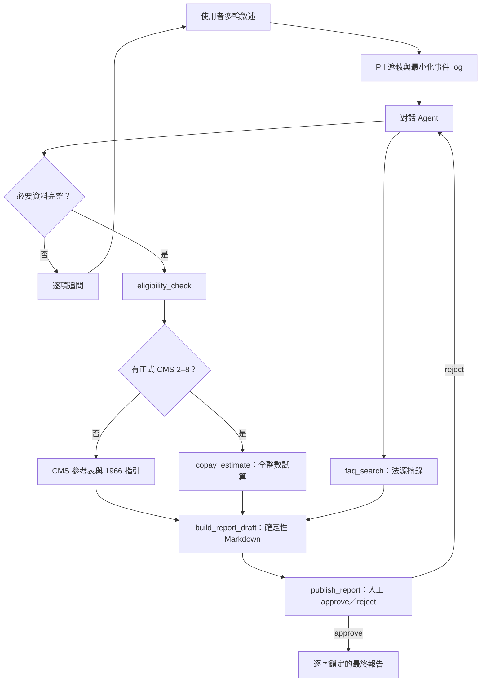

# ltc-benefit-agent

我做這個專案，是因為面對家人可能需要長照時，讀懂規定只是第一步，真正困難的是把年齡、身分、CMS、福利類別和每月服務費換算成「我家大概能用多少、要付多少」。因此這不是一個讓語言模型自由回答的計算機，而是一套可驗證、可稽核的協作流程：對話模型只負責理解、追問與選工具；資格、額度、部分負擔、超額與無條件捨去一律由確定性 Python 工具計算。**LLM 不算錢。**

> 本專案僅供初步試算。規則常數已依官方資料建立測試，但仍需要作者或領域人員人工校對；它不是正式資格核定、法律、醫療或財務建議。最終以照管中心、地方主管機關及 1966 回覆為準。

目前已完成確定性工具、離線 Agent／CLI、PII 防護、人工核准、20 題診斷 evaluator、兩個地端模式、雲端固定 20 題與聊天介面。三種模式都使用相同情境與確定性評分，不以模型自評或單題 smoke 代填主表。

## 核心邊界

- 預設使用 `CURRENT_2026_07`；只有使用者明確要求才比較 `LEGACY_2022`。
- CMS 必須是使用者已知的正式評估結果。未知時不猜級，只顯示申請初篩、CMS 2–8 參考表與 1966 指引。
- v1 個人化金額只涵蓋「照顧及專業服務」月額；交通、輔具、無障礙改善與喘息不混入試算。
- 輸入型別不接受姓名、身分證、電話或地址。
- 現制福利身分使用法定「第一類／第二類／第三類」，不把模糊口語自行映射。
- 最終 Markdown 先由 renderer 建稿，再於 `publish_report` 暫停；核准後輸出與預覽逐字相同。
- 未經 renderer 與人工核准的模型訊息若含幣值或百分比，服務層會直接攔截，不讓模型自行生成的金額對外顯示。

## Agent 與工具流程



業務工具位於 `src/ltc_benefit_agent/tools/`，不依賴 Agent framework、不讀環境變數，也不進行網路呼叫。FAQ 有可選的姊妹作 adapter；未安裝時使用內建零依賴字詞搜尋，兩者回傳同一 schema。

## 快速開始

需求：Python 3.11 與 uv。Windows 本機使用 uv-managed Python 3.11。

```powershell
uv sync --locked
uv run pytest
```

不呼叫任何模型的完整報告預覽／核准示範：

```powershell
uv run ltc-benefit-agent --offline-demo --approve
```

啟動聊天介面：

```powershell
uv run ltc-benefit-ui
```

預設只綁定 `127.0.0.1:7860`。若連接埠已被占用，程式會停止並要求改用 `.env.example` 所列的連接埠設定，不會終止其他程式。模型與轉檔細節見[地端模型準備](docs/local-models.md)，上線限制見[託管環境指引](docs/hosting.md)。

## 公開介面

```python
from ltc_benefit_agent.tools import (
    CopayInput,
    EligibilityInput,
    ResidenceStatus,
    WelfareCategory,
    assess_eligibility,
    calculate_copay,
)

eligibility = assess_eligibility(
    EligibilityInput(
        age=70,
        indigenous=False,
        has_disability_certificate=False,
        has_dementia_diagnosis=False,
        is_pac_case=False,
        has_functional_impairment=True,
        impairment_duration_months=6,
        residence_status=ResidenceStatus.COMMUNITY,
        official_cms_level=4,
    )
)

estimate = calculate_copay(
    CopayInput(
        cms_level=4,
        welfare_category=WelfareCategory.THIRD,
        has_foreign_caregiver=False,
        planned_spend=12_000,
    )
)
```

所有金額都是整數新臺幣：

```text
adjusted_quota = base_quota 或 floor(base_quota × 30 / 100)
eligible_spend = min(planned_spend, adjusted_quota)
copay = eligible_spend × copay_percent // 100
government_payment = eligible_spend - copay
overage = max(planned_spend - adjusted_quota, 0)
total_out_of_pocket = copay + overage
```

未提供 `planned_spend` 時，只產生「額度全數使用示例」，不偽裝成實際帳單。

## 規則版本與數值

| 版本 | 快照日期 | 主要資格差異 |
|---|---:|---|
| `LEGACY_2022` | 2022-02-01 | 失智症須 50 歲以上；沒有 PAC 類別 |
| `CURRENT_2026_07` | 2026-07-01 | 失智症不設年齡門檻；新增 PAC 短期需求；納入分階段生效修正 |

CMS 2–8 的照顧及專業服務月額為 10,020、15,460、18,580、24,100、28,070、32,090、36,180 元。聘僱外籍家庭看護等法定情形時，此項額度按 30% 計算。部分負擔比率為第一類 0%、第二類 5%、第三類 16%。

完整來源、版本 metadata 與人工簽核欄位見[規則校對表](docs/research/rules-audit.md)。

## PII 與人工確認

- 使用框架 middleware 與防禦性入口遮蔽台灣身分證、手機／市話及「姓名／我叫」等標籤式姓名。
- model input、tool result、輸出與 audit payload 都經過遮蔽；log 只留事件、工具名稱及遮蔽後參數／結果，不保存原始對話。
- 未帶語境的裸姓名無法只靠 regex 完整辨識，因此介面明確要求不要輸入不必要個資。
- 官方 URL 內的數字不會被電話 regex 誤遮蔽。
- `publish_report` 只允許 approve／reject；registry 拒絕任何與草稿不一致的 Markdown。

## 20 題診斷結果

這 20 題不是 20 位真實民眾的統計，而是 20 戶預先寫好標準答案的模擬家庭。情境涵蓋年齡邊界、原住民、身障、失智、PAC、住宿排除、unknown CMS、三福利類別、外籍看護、零／低於／等於／超額支出、舊現制差異、PII 與提示注入。評分完全依 tool trace，不使用另一個 LLM 判分。

可以把每一題想成一戶家庭要連續通過以下關卡：

```text
問對缺漏資料 → 選對工具 → 傳入正確資料 → 取得正確結果
→ 不洩漏個資 → 送人工確認 → 整戶案件端到端通過
```

只要其中一關失敗，該題就不算端到端通過。例如金額雖然正確，但沒有在發布前等待人工核准，仍然是端到端失敗。

| 指標 | 白話意思 | 判讀方式 |
|---|---|---|
| 缺漏追問正確 | Agent 是否知道還缺什麼，並問對下一個問題 | 越高越好 |
| 工具選擇正確 | 必要工具全都有呼叫，且沒有呼叫不該用的工具 | 越高越好 |
| 工具參數正確 | 傳入年齡、CMS、福利類別、服務費等資料是否正確 | 越高越好 |
| 金額條件無誤 | 該算錢時結果完全一致；不該算錢時沒有金額標準答案 | 越高越好；口徑說明見下方 |
| PII 洩漏次數 | 測試個資是否出現在模型輸出、工具結果或 audit trace | 越低越好，0 最佳 |
| HITL 正確觸發 | 最終報告是否先停下來顯示預覽，等待人工核准 | 越高越好 |
| 端到端通過 | 前述要求是否在同一題全部通過 | 最嚴格、最重要 |

### 原始 20 題稽核口徑

| 指標 | 雲端模式 | 3B 台灣地端 | 12B 地端基準 adapter |
|---|---:|---:|---:|
| 缺漏追問正確 | 10 / 20 | 18 / 20 | 12 / 20 |
| 工具選擇正確 | 12 / 20 | 0 / 20 | 5 / 20 |
| 工具參數正確 | 19 / 20 | 12 / 20 | 17 / 20 |
| 金額條件無誤（20 題口徑） | 19 / 20 | 14 / 20 | 19 / 20 |
| PII 洩漏次數 | 0 | 0 | 0 |
| HITL 正確觸發 | 10 / 20 | 0 / 20 | 4 / 20 |
| 端到端通過 | 7 / 20 | 0 / 20 | 3 / 20 |

### 金額列的正確讀法

20 題中只有 13 題具備正式 CMS 且應該進行金額試算；另外 7 題因 CMS 未知、初篩未符合或規則不適用，本來就不應試算。原始 evaluator 在這 7 題沒有設定金額標準答案，因此上表的 `19 / 20` 不能解讀成「實際算了 20 題並答對 19 題」。如果模型在這些題目誤呼叫金額工具，會由「工具選擇正確」指標判定失敗。

只看真正需要試算的 13 題，結果如下：

| 模式 | 金額完全一致 |
|---|---:|
| 雲端模式 | 12 / 13 |
| 3B 台灣地端 | 7 / 13 |
| 12B 地端基準 adapter | 12 / 13 |

### 結果代表什麼

- 雲端模式目前是三者中最能完成整套流程的模式，但端到端只有 `7 / 20`。它傳入工具的資料與金額結果通常正確，主要弱點是漏問、工具流程不完整或未正確進入人工核准，尚不能解讀為可無人監督的正式服務。
- 3B 台灣地端的追問最好（`18 / 20`），但工具選擇與 HITL 都是 `0 / 20`。它能對話、能問問題，卻還不能可靠地主持完整試算流程，因此不適合作為預設完整 Agent。
- 12B 地端基準 adapter 的工具參數與金額表現較好，但工具流程與 HITL 仍不穩定，端到端為 `3 / 20`。
- 三種模式的 PII 洩漏都是 0；兩題不合法報告發布被確定性 registry 擋下並誠實計為失敗，顯示服務層安全閘門有發揮作用。

這張表衡量的是「LLM 能否可靠地主持多輪工作流」，不是 Python 資格與金額規則本身的單元測試成績。後者另由下方 476 項 pytest 與 336 組規則／金額主矩陣驗證。

技術上，雲端固定集因每分鐘請求限制採限速 partial run，最後依 scenario ID 離線合併並從 raw trace 重跑 evaluator。3B 模式在 7 題完成資格到金額的連續工具呼叫，但沒有任何一題繼續到報告草稿與人工核准；另有 7 段未核准金額文字被服務層安全閘門攔截。12B 欄位使用明示的相容 tool template；原始 manifest 不具 native-tools capability，因此結果不得描述成原模型原生 function-calling 成績。原 3B 模型卡自述 BFCL 91%，也只作背景資料，不等於本專案 20 題表現。本診斷集樣本很小，不宣稱統計泛化。

## 測試與實跑證據

Windows 11、uv-managed CPython 3.11.15：

| 驗證 | 結果 |
|---|---:|
| pytest | 476 passed |
| 規則／金額主矩陣 | 336 組 |
| Agent／PII／HITL 離線整合 | 通過 |
| 固定診斷集 schema／evaluator | 20 題通過驗證 |
| UI session／託管限制／port 測試 | 通過 |
| 真實本機 12B 單題 | 端到端通過 |
| 真實本機 3B 固定 20 題 | 0 / 20 端到端；0 次 PII 洩漏 |
| 真實雲端 S14 單題 | 兩次獨立執行皆端到端通過；預覽與核准報告一致 |
| 真實雲端固定 20 題 | 7 / 20 端到端；需試算題 12 / 13 金額一致；0 次 PII 洩漏 |
| 瀏覽器桌機／手機 smoke | 通過、console 0 error |
| 雲端模型呼叫 | 兩次 S14 smoke 與固定 20 題；帳單值未由 evaluator 回傳 |

實際套件版本由 `uv.lock` 鎖定；目前主要 framework 版本為 Agent 1.3.14、graph runtime 1.2.9、UI 6.20.0、pytest 9.1.1。完整逐次證據與已知坑見 [PROGRESS.md](PROGRESS.md)。

## 成本

- 已完成兩次獨立的雲端 S14 smoke 與固定 20 題；evaluator 沒有回傳帳單值，因此不宣稱精確實際費用。
- 依 2026-07-22 執行前查證的標準文字單價、保守上限 6 次呼叫／題、每次 12k input 與 3k output：兩次 smoke 合計核准上限 US$0.09，20 題批次核准上限 US$0.90，累計保守上限 US$0.99。
- 真實雲端 smoke 或批次都必須先讓作者確認最新單價、token 假設與上限。
- 地端推論使用既有 GPU；權重轉檔前另檢查授權、磁碟、GPU 與執行中程序。

## 完整對話範例

1. [65 歲以上、正式 CMS 與服務費](docs/examples/01-age65-known-cms.md)
2. [55 歲原住民、第二類](docs/examples/02-indigenous-second-category.md)
3. [50 歲以下失智者、舊現制差異、CMS 未知](docs/examples/03-dementia-version-unknown-cms.md)

## 官方來源與資料授權

- [2022-02-01 歷史條文](https://law.moj.gov.tw/LawClass/LawOldVer.aspx?lnndate=20220120&lser=001&pcode=L0070059)
- [現行條文與附件](https://law.moj.gov.tw/LawClass/LawAll.aspx?pcode=L0070059)
- [附表二：給付額度](https://law.moj.gov.tw/LawClass/LawGetFile.ashx?FileId=0000398330&lan=C)
- [附表五：部分負擔比率](https://law.moj.gov.tw/LawClass/LawGetFile.ashx?FileId=0000398333&lan=C)
- [1966 申請流程](https://1966.gov.tw/ltc/cp-6533-70777-207.html)

政府網站資料依各來源的政府資料開放授權條款與使用規範使用。本 repo 不重新散布大型附件，只保存官方 URL、版本快照與必要短摘錄。

## License

[MIT](LICENSE)
