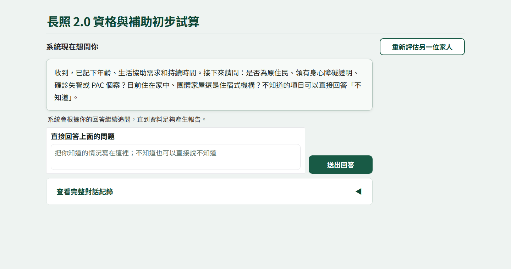
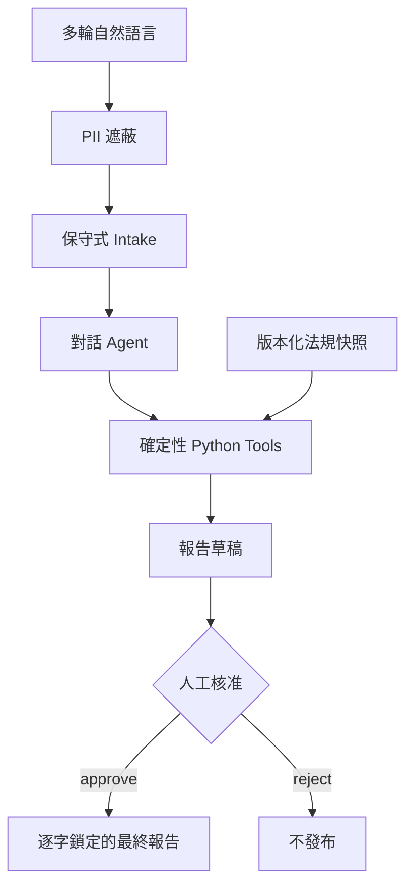

# ltc-benefit-agent

> **可驗證、可稽核的台灣長照 2.0 資格初篩與補助試算 Agent**


[](https://github.com/kuotunyu/ltc-benefit-agent/actions/workflows/ci.yml)


[線上 Demo](https://huggingface.co/spaces/steven0226/ltc-benefit-agent) ·
[v0.2.0 Release](https://github.com/kuotunyu/ltc-benefit-agent/releases/tag/v0.2.0) ·
[完整對話範例](docs/examples/01-age65-known-cms.md)

**模型負責對話，Python 負責資格與金額，人類負責最終核准。LLM 不算錢。**

| 測試 | 地端端到端 | 金額一致 | PII 洩漏 | 法規來源 |
|---:|---:|---:|---:|---:|
| **585 passed** | **20 / 20** | **13 / 13** | **0** | **4 個官方來源** |



## 為什麼做

我做這個專案，是因為家人可能需要長照時，真正困難的不是找到規定，而是把年齡、身分、CMS、福利類別與每月服務費換算成「可能符合什麼、政府負擔多少、自己要付多少」。

這不是自由生成答案的聊天機器人，而是一條有安全邊界的決策流程：

- 自然語言理解與追問交給模型。
- 資格、額度、部分負擔與超額全部由版本化 Python 規則計算。
- CMS 未知時不猜級、不產生個人化金額。
- 最終報告必須人工核准，核准內容與預覽逐字一致。

> 本專案僅供初步試算，不是正式資格核定或法律、醫療、財務建議；最終以照管中心、地方主管機關與 1966 回覆為準。

## 架構


```mermaid
flowchart TD
    U["多輪自然語言"] --> P["PII 遮蔽"]
    P --> I["保守式 Intake"]
    I --> A["對話 Agent"]
    A --> T["確定性 Python Tools"]
    T --> D["報告草稿"]
    D --> H{"人工核准"}
    H -- approve --> R["逐字鎖定的最終報告"]
    H -- reject --> X["不發布"]
    S["版本化法規快照"] --> T
```

核心工具位於 `src/ltc_benefit_agent/tools/`，不依賴 Agent framework、不讀環境變數，也不進行網路呼叫。模型或 Provider 可以替換，計算結果不因此改變。

## Safety by design

| 風險 | 系統保證 |
|---|---|
| 模型自行算錢 | 幣值只能由 deterministic tools 與 renderer 產生 |
| 把參考表誤認為 CMS | 未知 CMS fail closed，只顯示參考表與申請指引 |
| 福利身分誤判 | 明確口語由保守式 parser 正規化，模型不能覆蓋 |
| 個資進入模型或日誌 | 輸入、工具、輸出與 audit payload 都先遮蔽 |
| 草稿被竄改或重複發布 | 內容完整性檢查與 idempotent publish |
| 法規網站變動 | 語意指紋、結構化差異與人工複核；不自動改規則 |

## 模型選型與評估

同一組 20 題固定診斷集涵蓋年齡邊界、失智、PAC、住宿排除、unknown CMS、三種福利類別、外籍看護、超額支出、PII 與提示注入。評分依工具 trace，不使用模型自評。

| 模式 | 定位 | 初始端到端 | 強化後 | 金額題 | PII 洩漏 |
|---|---|---:|---:|---:|---:|
| 3B 台灣地端模型 | 輕量、在地語言 | 0 / 20 | **20 / 20** | **13 / 13** | **0** |
| 12B 地端基準 adapter | 跨模型基準 | 3 / 20 | **20 / 20** | **13 / 13** | **0** |
| 雲端歷史基線 | Provider 對照 | 7 / 20 | 尚未同版重跑 | 12 / 13 | 0 |

提升不是靠放寬規則，而是加入：

1. 只保存使用者明確提供資訊的 intake middleware。
2. 最多一次、只暴露必要工具的結構化重試。
3. 僅在已有成功工具證據後執行的 deterministic workflow continuation。
4. 報告 registry、PII gate 與 HITL 條件維持不變。

> `20 / 20` 是固定 regression set 的結果，不代表真實人口的統計泛化；雲端欄位是舊 workflow 歷史基線，不能直接宣稱同版模型排名。公開逐題摘要見 [local-models-v3.json](eval/results/local-models-v3.json)。

## 規則快照

預設版本為 `CURRENT_2026_07`；`LEGACY_2022` 保留作歷史差異比較。

| CMS | 2 | 3 | 4 | 5 | 6 | 7 | 8 |
|---:|---:|---:|---:|---:|---:|---:|---:|
| 照顧及專業服務月額 | 10,020 | 15,460 | 18,580 | 24,100 | 28,070 | 32,090 | 36,180 |

- 部分負擔：第一類 `0%`、第二類 `5%`、第三類 `16%`。
- 法定外籍看護情形：本項額度按 `30%` 計算，且有服務範圍限制。
- v1 個人化金額只涵蓋「照顧及專業服務」；不混入交通、輔具、無障礙改善與喘息服務。

代表案例：CMS 4、第三類、無外籍看護、當月服務費 NT$18,000 → **政府給付 NT$15,120，自付 NT$2,880**。

完整版本、生效日與人工簽核見[規則校對表](docs/research/rules-audit.md)。

## 法規快照稽核

獨立 checker 每月核對四個官方白名單來源，以 canonical semantic fingerprint 區分「檔案改版」與「規則語意改變」：

```text
官方來源 → 關鍵欄位擷取 → canonical JSON → SHA-256
        → structured diff → 人工複核 → 更新規則與測試
```

任何 `REVIEW_REQUIRED` 或 `CHECK_UNAVAILABLE` 都會 fail closed。流程只偵測差異，不使用 LLM，也不自動修改 production rules。詳見[法規來源 manifest](docs/research/rule-source-manifest.md)與[排程](.github/workflows/rule-audit.yml)。

## 快速開始

需求：Python 3.11、`uv`。

```powershell
uv sync --locked
uv run pytest
uv run ltc-benefit-agent --offline-demo --approve
```

啟動聊天介面：

```powershell
uv run ltc-benefit-ui
```

預設網址：`http://127.0.0.1:7860`。模型設定請複製 `.env.example`；金鑰只放 `.env`，不得進版控。地端準備見[地端模型指引](docs/local-models.md)。

## 驗證

| 驗證層 | 結果 |
|---|---:|
| pytest | **585 passed** |
| 規則／金額主矩陣 | **336 組** |
| 3B 台灣地端固定集 | **20 / 20** |
| 12B 地端基準固定集 | **20 / 20** |
| 需試算情境金額 | **13 / 13** |
| 已評估模式 PII 洩漏 | **0** |
| Windows CI | lock、pytest、sdist、wheel 全數通過 |
| 公開桌機／手機 smoke | 通過，console 0 error |

完整開發與驗收證據見 [PROGRESS.md](PROGRESS.md)。

## 成本

| 工作 | API 費用 |
|---|---:|
| 規則計算、測試、evaluator | **US$0** |
| 地端模型評估 | **US$0 API 費用** |
| 已完成歷史雲端 smoke／固定集 | 核准保守上限 **US$0.99**；無帳單回傳，不宣稱實際值 |
| v0.2.0 公開 smoke | 核准上限 **US$0.1776** |
| 最新 workflow 雲端 20 題重跑 | 上限 **US$1.776**；尚未核准、尚未執行 |

所有付費批次都必須先查證單價、估算 token 並取得核准。

## 官方來源與授權

- [歷史條文](https://law.moj.gov.tw/LawClass/LawOldVer.aspx?lnndate=20220120&lser=001&pcode=L0070059)
- [現行條文與附件](https://law.moj.gov.tw/LawClass/LawAll.aspx?pcode=L0070059)
- [附表二：給付額度](https://law.moj.gov.tw/LawClass/LawGetFile.ashx?FileId=0000398330&lan=C)
- [附表五：部分負擔比率](https://law.moj.gov.tw/LawClass/LawGetFile.ashx?FileId=0000398333&lan=C)
- [1966 申請流程](https://1966.gov.tw/ltc/cp-6533-70777-207.html)

政府網站資料依各來源的政府資料開放授權條款與使用規範使用。本 repo 不重新散布大型附件，只保存官方 URL、版本快照與必要短摘錄。

## License

[MIT](LICENSE)
