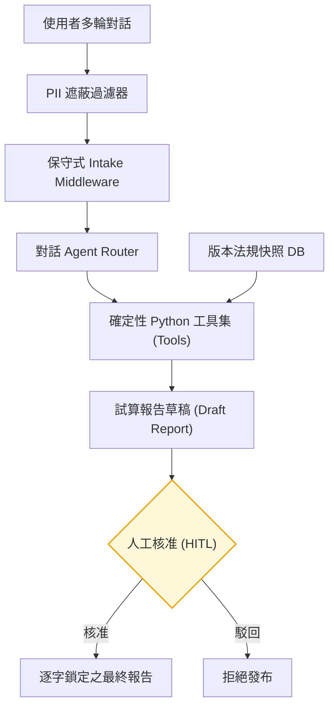

# ltc-benefit-agent

[](https://github.com/kuotunyu/ltc-benefit-agent/actions/workflows/ci.yml)


[](LICENSE)

本專案為具備確定性防禦與可驗證性的台灣長照 2.0 資格初篩與補助試算 Agent。系統遵守「模型負責自然語言對話與意圖理解，Python 負責資格與金額計算，人類專家 (HITL) 負責最終核准」的安全原則，徹底杜絕 LLM 幻覺引發的金額誤算與越權承諾。

> **免責聲明**：本專案僅供初步試算與學術研究，非正式資格核定或法律、醫療建議；最終資格與金額以照管中心、地方主管機關與 1966 專線核定為準。

[線上 Demo](https://huggingface.co/spaces/steven0226/ltc-benefit-agent) · [v0.2.0 Release](https://github.com/kuotunyu/ltc-benefit-agent/releases/tag/v0.2.0)


---

## 系統核心機制

1. **計算與對話分離 (Deterministic Tools Only)**：
   金額、級別與部分負擔比例完全由版本化 Python 規則引擎計算，模型無法自由產生或覆寫任何幣值。
2. **保守式 Intake 與 Fail-Closed 防禦**：
   在使用者未確定 CMS 級別前，系統不會進行猜測或產生個人化金額，嚴格避免誤導使用者。
3. **全文 PII 遮蔽與隱私保護**：
   使用者輸入、工具調用參數與日誌紀錄在發送至 LLM 之前全數經過 PII 遮蔽過濾，確保個資零洩漏。
4. **人工審核 (Human-in-the-Loop) 逐字鎖定**：
   試算報告草稿經由人工審核後發布，核准發布之內容與預覽草稿逐字簽章一致，防止中途竄改。

---

## 系統架構


```mermaid
%%{init: {'themeVariables': {'fontSize': '20px'}}}%%
flowchart TD
    U["使用者多輪對話"] --> P["PII 遮蔽過濾器"]
    P --> I["保守式 Intake Middleware"]
    I --> A["對話 Agent Router"]
    A --> T["確定性 Python 工具集 (Tools)"]
    T --> D["試算報告草稿 (Draft Report)"]
    D --> H{"人工核准 (HITL)"}
    H -- 核准 --> R["逐字鎖定之最終報告"]
    H -- 駁回 --> X["拒絕發布"]
    S["版本法規快照 DB"] --> T

    style H fill:#fff9db,stroke:#f59f00,stroke-width:2px
```

---

## 模型選型與橫向評測

專案針對地端與雲端模型進行 20 題端到端固定診斷集評測（涵蓋年齡邊界、失智、PAC、住宿排除、未知 CMS、福利類別、外籍看護、超額支出與 PII 提示注入）：

| 評測模型 / 模式 | 定位說明 | 初始端到端 | 強化後成功率 | 金額題準確度 | PII 洩漏筆數 |
|---|---|---:|---:|---:|---:|
| **3B 台灣地端模型** | 輕量化、繁體中文在地化 | 0 / 20 | **20 / 20** | **13 / 13** | **0 筆** |
| **12B 地端基準 Adapter** | 跨模型能力對照基準 | 3 / 20 | **20 / 20** | **13 / 13** | **0 筆** |
| **雲端歷史基線** | 商業 API 對照組 | 7 / 20 | 基線未重跑 | 12 / 13 | 0 筆 |

*註：585 項單元與整合測試全數通過，詳細評測細目請參閱 [eval/results/local-models-v3.json](eval/results/local-models-v3.json)。*

---

## 法規快照與計算規則

系統內建版本化長照法規快照（預設為 `CURRENT_2026_07`，保留 `LEGACY_2022` 供歷史比對）：

| CMS 級別 | 2 級 | 3 級 | 4 級 | 5 級 | 6 級 | 7 級 | 8 級 |
|---:|---:|---:|---:|---:|---:|---:|---:|
| **照顧與專業服務月額 (NT$)** | 10,020 | 15,460 | 18,580 | 24,100 | 28,070 | 32,090 | 36,180 |

- **部分負擔比率**：一般戶 16%、中低收入戶 5%、低收入戶 0%。
- **外籍看護扣減**：聘有外籍家庭看護者，照顧與專業服務額度按 30% 計算。
- **代表案例**：CMS 4 級、一般戶 (16%)、無外籍看護、當月服務費 NT$18,000 → **政府給付 NT$15,120，自付 NT$2,880**。

---

## 快速開始

需求：Python 3.11+、`uv`。

### 1. 安裝依賴與執行測試 (585 passed)

```powershell
uv sync --locked
uv run pytest -q
```

### 2. 啟動互動介面

```powershell
# 執行 Offline 驗證 Demo
uv run ltc-benefit-agent --offline-demo --approve

# 啟動 Web UI (開啟 http://127.0.0.1:7860)
uv run ltc-benefit-ui
```
